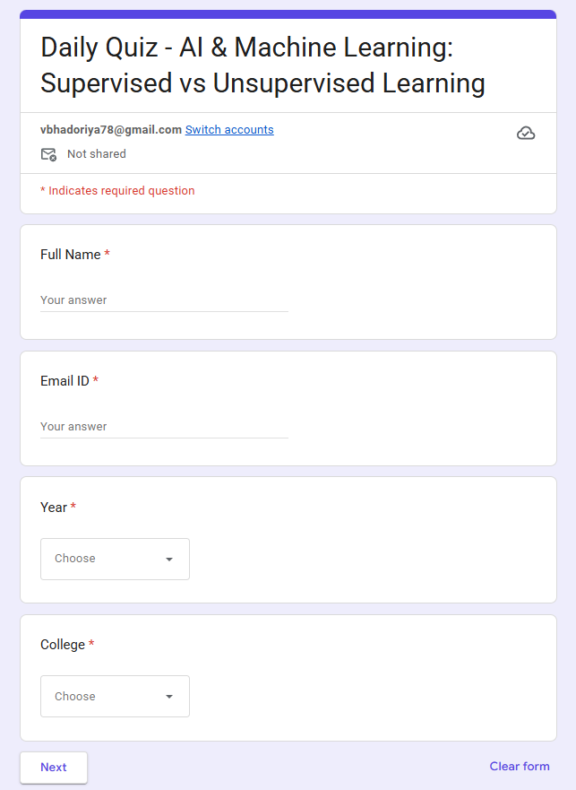
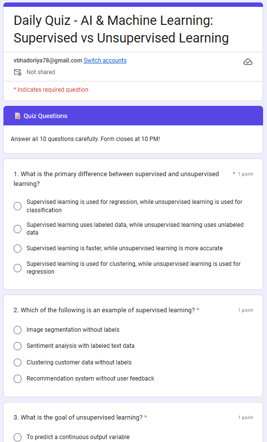
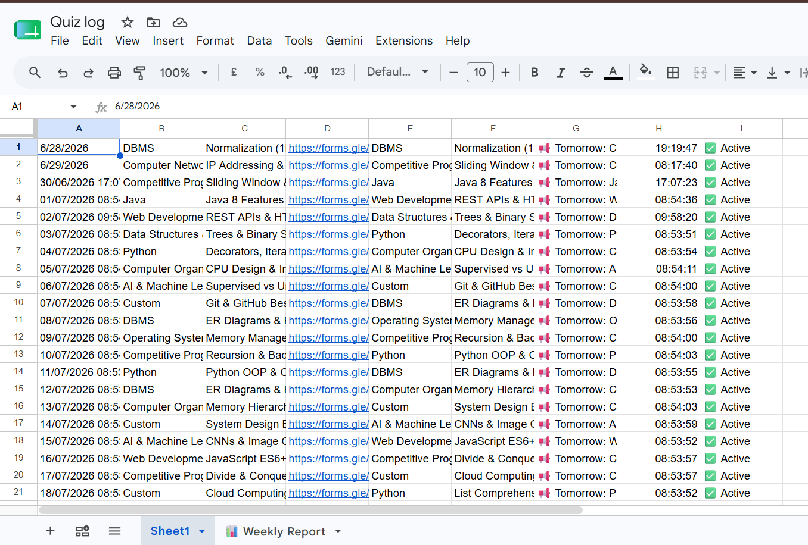
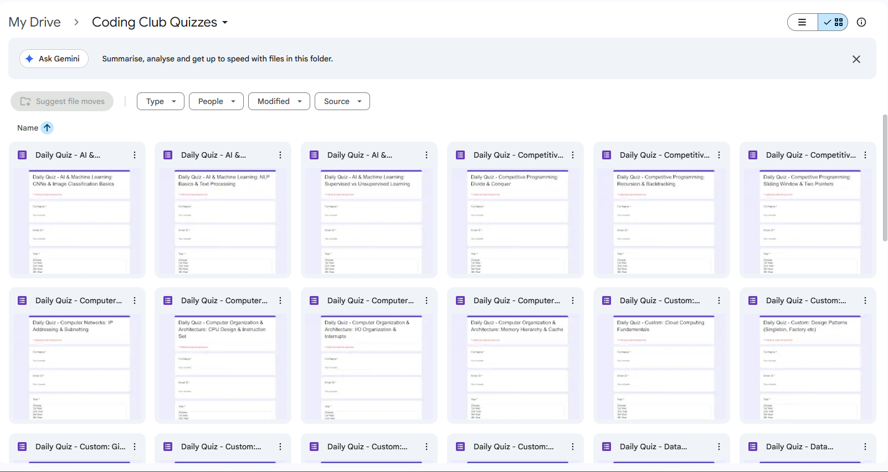

<div align="center">


<br/>
<br/>

### Fully automated daily coding quiz system for college coding clubs
### Zero manual effort · AI-powered · 100% Free · No server needed

<br/>

[](https://github.com/vaibhav44byte/coding-club-quiz-automation/stargazers)
[](https://github.com/vaibhav44byte/coding-club-quiz-automation/network)
[](LICENSE)
[](https://script.google.com)
[](https://console.groq.com)
[](CONTRIBUTING.md)

<br/>

[🚀 Get Started](#-setup-guide) &nbsp;·&nbsp; [✨ Features](#-features) &nbsp;·&nbsp; [📸 Screenshots](#-screenshots) &nbsp;·&nbsp; [🎨 Customize](#-customization) &nbsp;·&nbsp; [🤝 Contribute](#-contributing)

</div>

---

## 💡 Why This Exists

Running a college coding club means sending daily quizzes manually — writing questions, creating Google Forms, sharing links, tracking who responded — **every single day**. That's exhausting and inconsistent.

This project automates the **entire pipeline** from question generation to form creation to response logging:

```
Every day at 6 PM — fully automatic, no laptop needed:

  🤖  Groq AI generates 10 fresh MCQ questions
              ↓
  📋  Google Form created with student info fields
              ↓
  📊  Link + tomorrow's topic saved to Google Sheet
              ↓
  📢  You copy link → paste in WhatsApp (30 seconds)
              ↓
  🔒  At 10 PM — form closes automatically
```

---

## ✨ Features

<table>
<tr>
<td width="50%">

**🤖 AI-Generated Questions**
10 fresh MCQ questions daily via Groq's free LLaMA 3.3 API — never the same twice

</td>
<td width="50%">

**📋 Auto Google Forms**
Creates complete quiz form with student info fields (name, email, year, college)

</td>
</tr>
<tr>
<td>

**📊 Google Sheets Logging**
Every quiz logged with date, subject, topic, link and tomorrow's topic preview

</td>
<td>

**🔒 Auto Form Closing**
Submissions close at 10 PM every night — zero manual action

</td>
</tr>
<tr>
<td>

**📅 1-Day Advance Notice**
Tomorrow's topic revealed daily so students can prepare in advance

</td>
<td>

**🔄 Smart Topic Rotation**
All 11 subjects covered in order before any subject repeats

</td>
</tr>
<tr>
<td>

**✅ Instant Score + Answers**
Students see their score and correct answers immediately after submission

</td>
<td>

**📁 Auto Drive Organization**
All forms auto-saved in a "Coding Club Quizzes" folder in Google Drive

</td>
</tr>
<tr>
<td>

**🛡️ Duplicate Prevention**
Smart date-check ensures only one quiz is created per day even if triggered multiple times

</td>
<td>

**💯 Zero Cost Forever**
Runs entirely on Google's free servers — no hosting, no billing, no limits

</td>
</tr>
</table>

---

## 📚 Subjects Covered

```
01. Operating Systems                07. Python
02. DBMS                             08. Java
03. Computer Networks                09. Web Development
04. Computer Organization & Arch     10. AI & Machine Learning
05. Data Structures & Algorithms     11. Custom Topics
06. Competitive Programming              (Git, Linux, Cloud, System Design)
```

> Each subject has **5–7 unique topics**. No subject repeats until all 11 are fully covered — then the cycle resets automatically! ♾️

---

## 🏗️ How It Works

```
┌─────────────────────────────────────────────────────────────┐
│                    Google Apps Script                        │
│                   (Runs on Google Cloud)                     │
│                                                              │
│   ┌──────────────┐   ┌──────────────┐   ┌───────────────┐  │
│   │   Groq API   │──▶│ Google Forms │──▶│ Google Sheets │  │
│   │  (LLaMA 3.3) │   │     API      │   │     API       │  │
│   └──────────────┘   └──────────────┘   └───────────────┘  │
│          │                  │                   │            │
│   Generates 10        Creates quiz         Logs link +      │
│   MCQ questions         form               tomorrow topic   │
│                                                              │
│   ⏰ Trigger 1: Daily 6 PM → createDailyQuiz()              │
│   ⏰ Trigger 2: Daily 10 PM → closeTodaysForm()             │
└─────────────────────────────────────────────────────────────┘
```

---

## 📸 Screenshots

### 🖼️ Quiz Form — Student Info Page
> Students fill in their details before starting the quiz



---

### 📝 Quiz Form — Questions Page  
> 10 numbered MCQ questions with 1 point each — score shown immediately after submission



---

### 📊 Google Sheet Quiz Log
> Every quiz automatically logged — date, subject, topic, link, and tomorrow's topic all in one place



---

### 📁 Google Drive — Coding Club Quizzes Folder
> All auto-generated forms organized neatly in one folder



---

## 🚀 Setup Guide

### Prerequisites
- ✅ A **personal Gmail** account (not college/org account)
- ✅ A **free Groq API key** (takes 2 minutes)
- ✅ **30 minutes** for one-time setup

---

### Step 1 — Get Free Groq API Key

1. Go to 👉 [console.groq.com](https://console.groq.com)
2. Sign up with Gmail — completely free, no card needed
3. Click **API Keys** → **Create API Key**
4. Copy the key — it starts with `gsk_...`

> 💡 Groq gives **14,400 free API requests/day** — more than enough for one daily quiz

---

### Step 2 — Create Google Sheet

1. Go to 👉 [sheets.google.com](https://sheets.google.com)
2. Create a new **blank spreadsheet**
3. Name it **"Quiz Log"**
4. Copy the **Sheet ID** from the URL:

```
https://docs.google.com/spreadsheets/d/──► COPY THIS ◄──/edit
```

---

### Step 3 — Set up Google Apps Script

1. Go to 👉 [script.google.com](https://script.google.com)
2. Click **New Project** → rename it to **"Quiz Bot"**
3. Delete all existing code in the editor
4. Copy the full contents of [`script/Code.gs`](script/Code.gs) and paste it
5. Fill in your credentials at the top:

```javascript
var groqKey       = "gsk_YOUR_GROQ_KEY_HERE";      // ← paste your Groq key
var spreadsheetId = "YOUR_GOOGLE_SHEET_ID_HERE";   // ← paste your Sheet ID
```

6. Press **Ctrl + S** to save
7. Click **▶ Run** once → approve all permissions when prompted

---

### Step 4 — Set Up Daily Triggers

Click the **🕐 clock icon** (Triggers) in the left sidebar:

**Trigger 1 — Create quiz daily:**

| Setting | Value |
|---|---|
| Function to run | `createDailyQuiz` |
| Event source | Time-driven |
| Type | Day timer |
| Time of day | **6 PM – 7 PM** |

**Trigger 2 — Close form at night:**

| Setting | Value |
|---|---|
| Function to run | `closeTodaysForm` |
| Event source | Time-driven |
| Type | Day timer |
| Time of day | **10 PM – 11 PM** |

---

### Step 5 — Customize for Your Club

Open `script/Code.gs` and edit these sections:

**Change college names in the dropdown:**
```javascript
form.addListItem()
  .setTitle("College")
  .setChoiceValues([
    "Your College 1",   // ← replace with your colleges
    "Your College 2",
    "Your College 3"
  ])
```

**Add or remove subjects:**
```javascript
var subjectPool = {
  "Your New Subject": [
    "Topic 1",
    "Topic 2",
    "Topic 3"
  ],
  // ... existing subjects
};
```

**Change number of questions:**
```javascript
// Find this in the prompt and change 10 to any number
`Generate 10 multiple choice...`
//          ↑ change this
```

**Change quiz timing:**
Just update the trigger times in Apps Script — no code changes needed.

---

### ✅ Done! Here's what happens now:

| Time | What happens automatically |
|---|---|
| **6 PM** | Quiz generated, form created, link saved to Sheet |
| **6 PM** | Tomorrow's topic appears in your Sheet |
| **You** | Copy link + tomorrow's topic → paste in WhatsApp (30 sec) |
| **10 PM** | Form closes, no more submissions accepted |
| **Next day** | Repeat — forever ♾️ |

---

## 🎨 Customization

### Difficulty Level
Change this line in the prompt inside `Code.gs`:
```javascript
// Current: Easy to Medium
"Difficulty level: Easy to Medium only."

// To make harder:
"Difficulty level: Medium to Hard."
```

### Question Count
```javascript
// Change 10 to any number you want
`Generate 10 multiple choice coding quiz questions`
```

### Closing Time
Change the `closeTodaysForm` trigger from `10 PM – 11 PM` to any time you prefer — directly in Apps Script triggers, no code changes needed.

### Add Weekly Report
The repo includes a `generateWeeklyReport()` function — add a **weekly trigger** (Monday 9 AM) to auto-compile all quiz responses into a summary sheet.

---

## ❓ FAQ

**Q: Does my laptop need to be ON for the quiz to run?**
> No! It runs entirely on Google's servers. Your laptop can be completely OFF, closed, or in another city.

**Q: Is this really free?**
> Yes — Google Apps Script, Groq API free tier, Google Forms, Google Sheets, and Google Drive are all free. Total cost: ₹0.

**Q: What if quiz generation fails one day?**
> The script retries automatically up to 3 times. If all retries fail, nothing is written — no corrupted data.

**Q: Can I use this for non-CS subjects?**
> Absolutely! Just replace the `subjectPool` object with your own subjects and topics.

**Q: Will the same topic repeat daily?**
> No — a smart rotation system ensures all 11 subjects are covered before any repeats. Topics within each subject are also randomized.

**Q: What if I run the script twice by mistake?**
> The duplicate-check system detects today's date in the sheet and skips creating a second quiz.

---

## 🤝 Contributing

Contributions, suggestions, and ideas are very welcome! 🙌

```bash
# 1. Fork the repo
# 2. Create your branch
git checkout -b feature/your-amazing-feature

# 3. Commit your changes
git commit -m "Add: your amazing feature"

# 4. Push to your branch
git push origin feature/your-amazing-feature

# 5. Open a Pull Request
```

### 💡 Ideas for contributions

- 🌐 Custom website to display daily quiz (no Google Forms)
- 📱 Telegram bot auto-posting
- 🏆 Student leaderboard system
- 📈 Analytics dashboard for response tracking
- 🎯 Difficulty levels (easy / medium / hard toggle)
- 🌍 Multi-language support
- 📧 Email digest of quiz results

---

## 📄 License

```
MIT License — Copyright (c) 2026 Vaibhav Bhadoriya

Free to use, copy, modify, and distribute with attribution.
See LICENSE file for full terms.
```

---

## 👨‍💻 Author

<div align="center">

**Vaibhav Bhadoriya**

AI/ML Engineer · Backend Developer · Coding Club Lead @ TIT

[](https://github.com/vaibhav44byte)
[](https://linkedin.com/in/yourprofile)

</div>

---

<div align="center">

**⭐ If this project helped your coding club, please star it — it helps others find it too!**

<br/>

*Made with ❤️ for college coding clubs everywhere*

</div>
